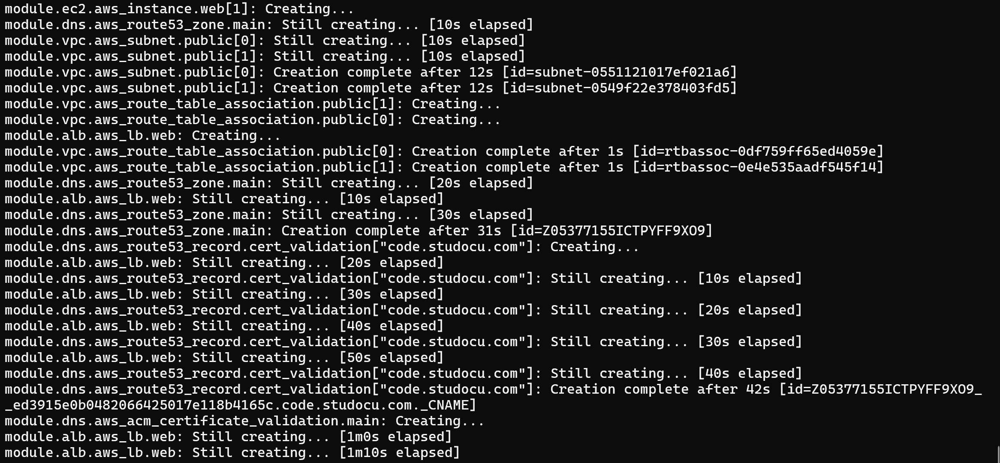

# studocu-interview-challenge


## Introduction

This repository contains the code to create a static website hosted on AWS EC2 and served by CloudFront. The website is also created using Terraform.

## Prerequisites

- Terraform installed
- AWS CLI installed and configured
- A subdomain name

## Assumptions

- We do not care about HashiCorp's BSL license change, if we did we would have to use OpenTofu instead. I would actually prefer to use OpenTofu anyway but for this challenge I'm using Terraform.
- We are not setting a remote backend to store state for this challenge, so the state file will be stored locally. A good practice is to store the state file in a remote backend like S3 to enable collaboration and state locking.
- The website is a static website, so we are not using any backend services like Lambda, API Gateway, or RDS.

## Architecture

The architecture of the website is as follows:

1. A VPC with a public subnet and an internet gateway.
2. Security groups to allow traffic to the EC2 instances and the load balancer.
3. Two EC2 instances hosting the website content.
4. An ALB to route traffic to the domain.
6. DNS - Route53 to manage the domain and subdomain.
7. ACM to manage the SSL certificate for the domain and subdomain.
8. [_can't for permission issues_] A CloudFront distribution to serve the website content on HTTPS.
9. Default tags for all resources. (Yes this is indeed part of the architecture)

### Future improvements

- Use a remote backend to store the state file.
- Have a security group module to manage the security groups.
- Disallow public access to the EC2 instances and only allow traffic from the ALB.
- Enable smarter routing in the ALB and add health checks.
- Add autoscaling to the EC2 instances.
- Add a bastion host to access the EC2 instances for troubleshooting.
- Use an S3 bucket to store the static website content instead of hosting it on the EC2 instances.
- Use CloudFront to serve the static content from the S3 bucket.
- [Bonus] Totally get rid of the EC2 instances if the website is just static pages

## How to run

To create your website infra run the following commands:

```bash
# aws
aws configure set aws_access_key_id <key>
aws configure set aws_secret_access_key <secret>
# verify the configuration
aws sts get-caller-identity

# terraform
terraform init
terraform plan -var 'subdomain=example'
terraform apply -var 'subdomain=example' --auto-approve

# or with a var file (terraform.tfvars)
terraform apply -var-file=terraform.tfvars --auto-approve
```

Loadbalancer takes some time to provision, so you might need to wait for a few minutes before the terraform script is finished and the website becomes accessible.



You should then see the output with the domain name of the website. You can access the website using the domain name.

To clean it up after you are done:

```bash
terraform destroy --auto-approve
```

**Time to solve this**: 3 hours of actual work, in total.

**Elapsed time**: A while, since I have a full-time assignment and I'm also interviewing at the same time, which is another fulltime job... 
Also had to do it on my very little and scattered spare time, mainly on the weekend.

## Notes

### Error with the website

There's an error HTTP 502 error when accessing the website - see [this doc](https://docs.aws.amazon.com/elasticloadbalancing/latest/classic/ts-elb-error-message.html#ts-elb-errorcodes-http502), it's most probably an error with the ec2 content being served.
I would have to troubleshoot the EC2 instances to see what's going on and I don't have time for that right now.

### Permission issue with CloudFront

Permission issues with CloudFront, so I couldn't create the distribution. I would have to create the distribution manually in the AWS console or update the IAM policy to allow the user to create the distribution.

```bash
Error: error creating CloudFront Distribution: AccessDenied: User: arn:aws:iam::100460019285:user/test is not authorized to perform: cloudfront:CreateDistribution on resource: arn:aws:cloudfront::100460019285:distribution/* because no identity-based policy allows the cloudfront:CreateDistribution action
│       status code: 403, request id: 05c9e492-8415-41e6-b97a-c0cd7c46a8da
```